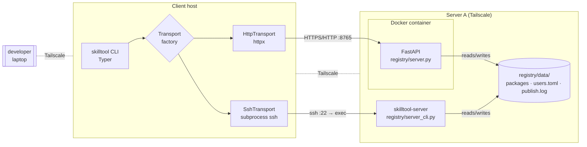
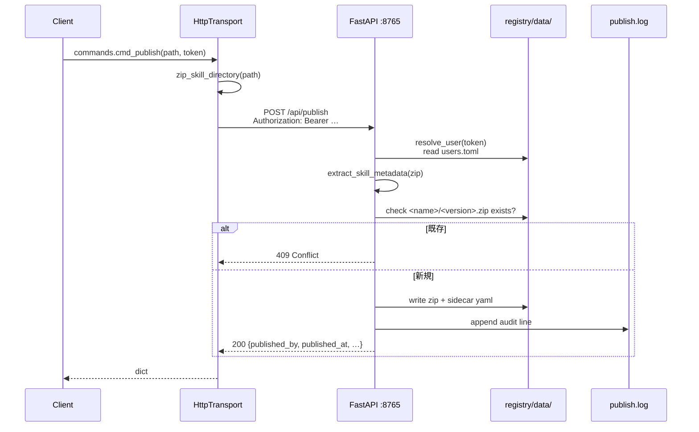
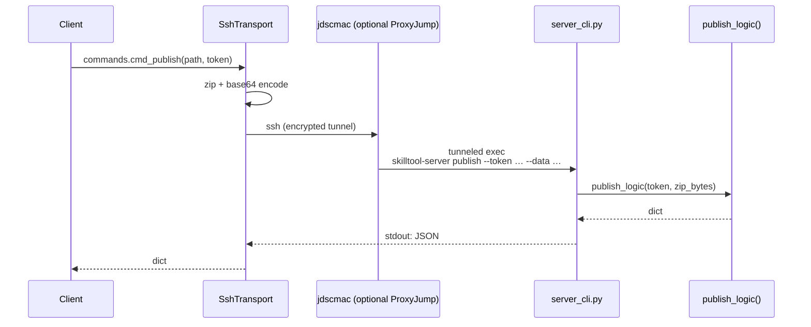
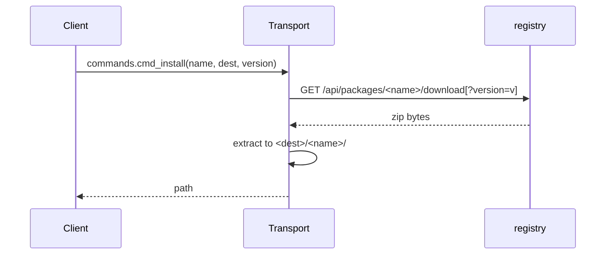

# skilltool 実装アーキテクチャ

本ドキュメントは skilltool-infra を **どう設計したか** と **どの責務が
どこに住んでいるか** を説明するリファレンスです。運用手順や Quick
Start は [README](../../README.md) を、publish の具体手順は
[publishing.md](./publishing.md) を、`skill.toml` の仕様は
[package-manifest.md](./package-manifest.md) を、現状の制限は
[limitations.md](./limitations.md) を、トランスポート個別の話は
[docs/transport.md](../transport.md) を、ディレクトリ構成だけは
[repository-architecture.md](./repository-architecture.md) を参照して
ください。

---

## 1. 目的と範囲

skilltool は `skill.md`（Claude Agent Skills）を PyPI 的に配布する
社内向け registry です。設計のコア要件:

1. **Tailscale を信頼境界** として、Tailnet 内部の任意のノードから
   reach できること。
2. `skill.md` を **個別アーティファクト単位で version 管理** し、
   override を禁じる（同一 `name@version` の二重 publish は 409）。
3. **publish の監査** を server 側で一元化（誰が・いつ・何を）。
4. **運用を最小限** に保つ — Docker Compose 1 つで動き、ユーザ管理は
   平文 TOML + shell スクリプトで済む。
5. クライアントとサーバ間の通信を **差し替え可能** に保つ — まず
   HTTP、必要に応じて SSH。

---

## 2. システム全体像



**ポイント**

- HTTP / SSH 両トランスポートとも `registry/data/` という **同じストレージ**
  に読み書きする。切替は wire の問題にすぎず、データ整合性は 1 箇所で担保。
- HTTP path は FastAPI の `publish_logic()` を、SSH path は同じ関数を
  server_cli.py 経由で呼ぶ。publish のセマンティクスは 1 実装のみ。

---

## 3. コンポーネント詳細

### 3.1 Client

`client/src/skilltool/` 配下。責務別にファイルを分けてある。

| ファイル | 責務 |
| --- | --- |
| [cli.py](../../client/src/skilltool/cli.py) | Typer のコマンド配線。input 検証は Typer に任せ、ビジネスロジックは `commands` に丸投げ |
| [commands.py](../../client/src/skilltool/commands.py) | 各 CLI サブコマンドの実装。skill ディレクトリの zip 化、インストール展開、discover など |
| [api.py](../../client/src/skilltool/api.py) | Transport factory。後方互換の `RegistryClient(cfg)` は `get_transport(cfg)` の別名 |
| [config.py](../../client/src/skilltool/config.py) | 解決順 env → TOML → localhost 自動検出 → default |
| [output.py](../../client/src/skilltool/output.py) | Rich ベースの出力ヘルパ |
| [transport/base.py](../../client/src/skilltool/transport/base.py) | `Transport` ABC と `RegistryError` |
| [transport/http.py](../../client/src/skilltool/transport/http.py) | httpx で FastAPI を叩く実装 |
| [transport/ssh.py](../../client/src/skilltool/transport/ssh.py) | `ssh user@host skilltool-server <verb>` を subprocess で実行 |

CLI は **transport の存在をまったく知らない** 設計にしている。
`commands.py` は `RegistryClient(cfg)` 経由で `Transport` メソッド
（`package` / `search` / `download` / `publish` / `audit`）のみを叩く。

### 3.2 Registry (HTTP)

[registry/server.py](../../registry/server.py) は FastAPI アプリ。

- **エンドポイント**

  | Method + Path | Auth | 役割 |
  | --- | --- | --- |
  | `GET  /` | – | PyPI-like HTML index。Name / Tag / Description の regex 検索フォーム + Tags 列 |
  | `GET  /packages/{name}` | – | HTML package page。version ごとの published_at / published_by + Tags 表示 |
  | `GET  /api/health` | – | liveness |
  | `GET  /api/packages/{name}` | – | JSON metadata + version 一覧 |
  | `GET  /api/packages/{name}/download` | – | zip ダウンロード |
  | `GET  /api/search` | – | `q` / `name` / `tag` / `description` の regex match（AND 結合） |
  | `POST /api/publish` | Bearer | zip アップロード |
  | `GET  /api/audit` | Bearer | audit log 返却 |

- **共通化された core logic**

  publish の骨は `publish_logic(token, zip_bytes) -> dict` として
  切り出してある。FastAPI handler と [server_cli.py](../../registry/server_cli.py)
  の `publish` verb の両方がこの 1 関数を呼ぶ。

- **読み取り系は認証なし**

  Tailscale が perimeter なので、browse 機能・install 機能は token
  なしで使える。書き込み系は必ず Bearer で書き込み者を同定。

### 3.3 Server CLI (SSH)

[registry/server_cli.py](../../registry/server_cli.py) は「SSH 越しに
呼ばれる薄いラッパ」で、`skilltool-server <verb> [args...]` の形で
verb ごとに server.py のロジックを呼ぶ。

- **stdout は JSON 1 行のみ**（`download` verb のみ生の zip bytes）
- **ログ・エラーはすべて stderr** へ。wire format を壊さないため
- 非ゼロ終了コードでエラーを示す → クライアント側で
  `RegistryError` に畳まれる

verb と server.py 関数の対応:

| Verb | 呼ぶ関数 |
| --- | --- |
| `list` | `all_packages()` |
| `search <regex>` | `all_packages()` + `re.search` |
| `show <name>` | `list_versions()` + `load_manifest()` |
| `download <name> [--version v]` | `PACKAGES_DIR / name / f"{v}.zip"` |
| `publish --token t --data b64` | `publish_logic(t, zip_bytes)` |
| `audit [--limit n]` | `AUDIT_LOG.read_text()` + `_parse_audit_line()` |

---

## 4. ストレージモデル

### 4.1 ディレクトリ配置

コンテナ内では `/data/`、ホスト側では `registry/data/` にマウントされる。

```text
/data/
├── packages/
│   └── <name>/
│       ├── <version>.zip      # 生 zip payload
│       └── <version>.yaml     # metadata sidecar
├── users.toml                 # per-user トークン台帳
└── publish.log                # 監査ログ（append-only）
```

ファイル単位で管理するため、DB も race-prone な global index も持たない。
サーバは毎回 directory を scan するだけで整合性を保つ。

### 4.2 メタデータ sidecar

publish 時に **`skill.toml` の `[skill]` テーブル**（または後方互換で
`skill.md` の YAML frontmatter）をパースし、サーバ側で
`published_by` / `published_at` / `manifest_format` / `published_teams`
を追記して `.yaml` で保存する。

```yaml
name: docx
version: 1.0.0
description: Author docx from Claude
author: team-doc
entry: SKILL.md                      # skill.toml 由来（legacy では無い）
manifest_format: skill.toml          # サーバが付与
published_by: alice                  # サーバが付与
published_at: "2026-04-15T10:23:45Z" # サーバが付与
published_teams:                     # caller の users.toml.teams から
  - team-doc
  - team-infra
tags: [office, docx]                 # 未知キーも preserve
```

これにより `GET /api/packages/docx` のレスポンスは zip を再度開かずに
返せる。manifest の仕様詳細は
[package-manifest.md](./package-manifest.md)。

### 4.3 users.toml

```toml
[users.alice]
token    = "tok_alice_<64 hex>"
teams    = ["team-doc"]
# disabled = true   # 失効
```

- サーバは **毎リクエストで tomllib.load** する → 編集・revoke 即時反映
- `token` は `add-user.sh` が `openssl rand -hex 32` で生成
- `teams` は現状メタデータ扱い。将来のチーム ACL の拡張ポイント

### 4.4 publish.log

```text
2026-04-15T10:23:45Z  alice            docx                 1.2.0 → 1.3.0
2026-04-15T14:05:12Z  bob              frontend-design      2.0.0 (new)
```

Fixed-width カラムで `tail -f` に耐える形。`_parse_audit_line()` が
`ts` / `user` / `package` / `detail` に分解してくれるので JSON でも
返せる。

---

## 5. 認証・認可モデル

### 5.1 Per-user token (task002)

- token は **サーバ側でのみ発行** される（`setup/server/add-user.sh`）
- wire は `Authorization: Bearer <token>`（HTTP）または
  `--token <token>` 引数（SSH verb）
- 検証は毎回 `resolve_user(token)` で `users.toml` を scan

### 5.2 Audit

- 成功 publish のみ記録（400/401/409 は log しない）
- `GET /api/audit` は認証必須 — つまり「audit を読める＝有効トークン
  を持っている」
- `registry/data/publish.log` は append-only の運用を想定（`chmod 640
  skilltool:skilltool` で root 以外は上書き不可）

### 5.3 Package ownership は **意図的に持たない**

現状 `users.toml` の `teams` は参考情報で、「team-A のユーザは package-X
しか publish できない」といったチェックは入っていない。理由:

- 最小の surface で始めて監査ログで誰がやったか追える状態を先に作る
- チーム ACL が必要になった段階で `publish_logic()` に 1 ブロック追加
  するだけで乗せられる（拡張性を確保済み）

---

## 6. トランスポート抽象化 (task003)

### 6.1 Transport ABC

```python
class Transport(ABC):
    def health(self) -> dict: ...
    def package(self, name: str) -> dict: ...
    def search(self, query: str) -> list[dict]: ...
    def download(self, name: str, dest: Path, version: str | None) -> Path: ...
    def publish(self, zip_path: Path, *, token: str | None) -> dict: ...
    def audit(self, limit: int) -> dict: ...       # optional
```

**意味的メソッド** を並べるだけの ABC。URL・wire 形式は各 transport
の内部事情。

### 6.2 HttpTransport

- `httpx.Client(base_url=cfg.registry, timeout=60)`
- publish は multipart `file=` + `Authorization: Bearer <token>`
- HTTP エラーは body の `detail` を抜いて `RegistryError` に畳む

### 6.3 SshTransport

- `subprocess.run(["ssh", ...opts, f"{user}@{host}", "skilltool-server", *verb_args])`
- verb → argv は各メソッドで個別に組み立て（URL を経由しない分、
  任意の拡張がしやすい）
- `SKILLTOOL_SSH_COMMAND` で先頭の `ssh ... skilltool-server` を全置換
  可能 → E2E テストで実 sshd なしに同じ境界を通せる

ssh 起動時のオプション:

```text
BatchMode=yes               # パスワードプロンプト禁止（常に鍵認証）
ConnectTimeout=10           # 10s で fail fast
StrictHostKeyChecking=accept-new   # 初回は trust on first use
```

### 6.4 選択ロジック

[config.py](../../client/src/skilltool/config.py) の解決順:

1. `SKILLTOOL_TRANSPORT` / `SKILLTOOL_SSH_HOST` など env var
2. `~/.config/skilltool/config.toml`
3. localhost:8765 が 1 秒以内に応答すれば registry を自動で `http://localhost:8765` に
4. default: `transport="http"`, `ssh_user="skilltool"`

### 6.5 新しい transport を足すには

1. `client/src/skilltool/transport/<name>.py` に `Transport` サブクラスを実装
2. `transport/__init__.py` に export
3. [api.py](../../client/src/skilltool/api.py) の `get_transport()` に
   `if mode == "<name>": ...` ブランチを 1 つ追加

`commands.py` は触らなくてよい。

---

## 7. データフロー

### 7.1 Publish (HTTP)



### 7.2 Publish (SSH)

HTTP と **ロジック的に完全に同じ**。wire だけが変わる:



jdscmac は暗号化トラフィックのみ見える。token も zip も中継ホストから
読み取れない（ProxyJump の性質）。

### 7.3 Install



HTTP は httpx で stream、SSH は subprocess stdout から bytes を受け取る。

---

## 8. デプロイ構成

### 8.1 レイヤ分担

| 層 | 役割 | 具体 |
| --- | --- | --- |
| systemd | lifecycle (起動／停止／再起動) | [setup/server/systemd/skilltool.service](../../setup/server/systemd/skilltool.service) |
| docker compose | アプリ実行環境 | [registry/docker-compose.yml](../../registry/docker-compose.yml) |
| Dockerfile | image の build | [registry/Dockerfile](../../registry/Dockerfile) |
| bind mount | 永続データ | `./data/:/data/` |
| service user | プロセス境界 | `skilltool` system user, home=`/srv/skilltool` |

systemd → docker compose → container (uvicorn + FastAPI) の 3 段。
docker daemon 自体は別 service (`docker.service`) で動く。

### 8.2 UID/GID マッチング

bind mount は container 内外で inode を共有するため、container が
root で書くとホスト skilltool ユーザが編集不可になる。これを防ぐため
compose で:

```yaml
user: "${PUID:-0}:${PGID:-0}"
```

`.env` に `PUID=$(id -u)` / `PGID=$(id -g)` を書くと、container process
が host の skilltool UID で動き、`registry/data/users.toml` 等を
host 側から編集できる。

> デフォルトは `0:0`（root）。dev 環境では未設定のまま動く、production
> では必ず `.env` に PUID/PGID を入れる、という切り分け。

### 8.3 /srv/skilltool の構成

```text
/srv/skilltool/                        skilltool:skilltool 0750
├── skilltool-infra/                   ← git checkout
│   ├── registry/
│   │   ├── data/                      bind mount target (PUID/PGID で書かれる)
│   │   └── .env                       PUID, PGID, SKILLTOOL_BIND など
│   └── setup/server/systemd/skilltool.service  → /etc/systemd/system/ へ symlink/copy
└── .ssh/authorized_keys               SSH transport 用 (--with-ssh 時)
```

### 8.4 SSH transport 併用

`install.sh --with-ssh` で:

1. 既存の `skilltool` ユーザ（home=`/srv/skilltool`）に `/bin/bash` を与え
2. `/usr/local/bin/skilltool-server` を `registry/server_cli.py` への symlink に
3. `registry/data/` のグループを `skilltool` にして group-read を付与

クライアント側は `~/.ssh/config` で `ProxyJump` を使うと 2 段 hop でも
skilltool は配線を意識しない:

```sshconfig
Host skilltool-server
    HostName 10.0.0.5
    User skilltool
    ProxyJump jdscmac
```

---

## 9. ネットワーク境界

```text
[developer laptop]
       │  Tailscale (WireGuard over UDP)
       ▼
   [jdscmac]              ← 任意の jump host (Option)
       │  Tailscale or LAN
       ▼
  [Server A : 100.x.x.x]
       ├─ :8765  HTTP (FastAPI, via docker)
       └─ :22    SSH  (skilltool user, via skilltool-server)
```

- HTTP transport のデフォルト bind は `0.0.0.0:8765` だが、
  `SKILLTOOL_BIND=100.x.x.x` を `.env` に入れると Tailscale IF でのみ
  listen する（eth0 側を塞ぎたいとき）
- SSH transport は sshd (port 22) のみ。`skilltool` ユーザの鍵認証で
  ゲートキープ
- `GET /api/audit` と `POST /api/publish` は Bearer token が追加の
  defense-in-depth を提供（Tailscale 内の別ユーザによる誤操作防止）

---

## 10. 拡張ポイント

現状の設計で「小さく始めて後から育てる」ために用意した余白。

| 拡張 | 影響範囲 | 必要な作業 |
| --- | --- | --- |
| **チーム ACL** (package 単位) | `publish_logic()` に 1 ブロック | 既存 sidecar yaml の `published_teams` と user の `teams` を intersect |
| **新 transport 追加** (gRPC 等) | `transport/<name>.py` + `api.get_transport()` | `Transport` ABC 実装 + factory ブランチ |
| **Web UI の検索 / フィルタ** | `server.py` の `home()` / `package_page()` | 現状は static HTML。Jinja2 テンプレ化 → 検索フォーム追加 |
| **Tailscale ACL 連携** (users.toml 廃止) | `resolve_user()` を tailnet identity 参照に置換 | `tailscale whois` で caller を特定し、台帳不要に |
| **package 削除 / yank** | `server.py` に DELETE エンドポイント、sidecar yaml に `yanked: true` を追加 | 現状は append-only なので、yank 概念導入で "削除はしない" を維持 |
| **非同期 publish (CI)** | GitHub Actions で SSH transport を叩くジョブ | `setup/client/install.sh` を Actions runner にインストール |

いずれも「既存コードを書き換えずに一箇所追加」で済む構造にしてあるのが
設計上の投資。

---

## 11. テスト戦略

| 層 | 場所 | 目的 |
| --- | --- | --- |
| Unit | [tests/unit/](../../tests/unit/) | 純粋関数（config 解決、SSH verb 組み立て） |
| Integration | [tests/integration/](../../tests/integration/) | subprocess で server_cli.py 直叩き、または subprocess mock で SshTransport を検証 |
| E2E | [tests/e2e/](../../tests/e2e/) | SshTransport ↔ server_cli.py を subprocess 経由で結線。`SKILLTOOL_SSH_COMMAND` で実 sshd を代替 |

合格基準は task003 §7 に準じる（`pytest tests -q` で 40/40 pass）。

---

## 12. 関連ドキュメント

- [README](../../README.md) — Quick Start と運用レシピ
- [publishing.md](./publishing.md) — publish 手順と skill.toml の使い方
- [package-manifest.md](./package-manifest.md) — `skill.toml` 完全仕様
- [limitations.md](./limitations.md) — 現状の制限と拡張ポイント
- [../transport.md](../transport.md) — HTTP / SSH 切り替え
- [repository-architecture.md](./repository-architecture.md) — ツリー
- [../development-rules/BRANCH_STRATEGY.md](../development-rules/BRANCH_STRATEGY.md)
- [../development-rules/VERSIONING_POLICY.md](../development-rules/VERSIONING_POLICY.md)
